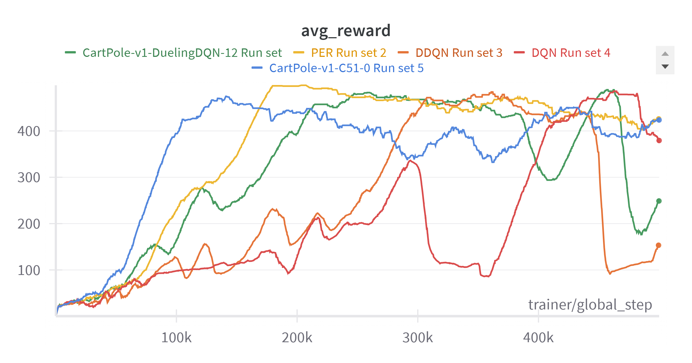

<table>
  <tr>
    <td></td>
</table>

**[Pytorch-Lightning](https://github.com/Lightning-AI/pytorch-lightning) Implementations of Fundamental RL Algorithms**
______________________________________________________________________

# NOTICE
⚠️ **Current Status**: All implemented algorithms are currently tested and optimized for the CartPole-v1 environment only. Future updates will include support for additional environments.

## Off Policy

This section lists the off-policy algorithms implemented in this project. Off-policy methods can learn from experiences generated by a different policy, allowing for more flexible learning.
- [x] DQN **(24-09-24)**
- [x] Double DQN **(24-10-10)**
- [x] Dueling DQN **(24-10-31)**
- [ ] Noisy DQN
- [x] DQN with Prioritized Experience Replay **(24-10-25)**
- [x] C51 **(24-11-05)**
- [ ] QR-DQN
- [ ] N Step DQN
- [ ] DDPG
- [ ] TD3
- [ ] SAC

#### To-Do
This section outlines our future plans and upcoming implementations. We're constantly working to expand our collection of algorithms and improve existing ones.

#### Features

These are the additional features and tools we've integrated to enhance the functionality and usability of our implementations.
- [x] Wandb Logger
- [x] Record a training video and show in wandb **(24-09-25)**

#### Done

This section tracks our recent accomplishments and completed tasks, providing a clear view of our progress.
- [X] Implement Double DQN
- [x] Change Wandb Logging naming convention -> "(Env-Algo-Number)"
- [x] Using Argparse to manage hyperparams
- [x] Implement Dueling DQN

#### Experimental Results
Here we present the performance results of our implemented algorithms. These graphs and metrics help visualize the effectiveness of each method.

**Cartpole-v1 average reward**

This graph shows the average reward achieved by our algorithms on the CartPole-v1 environment, demonstrating their learning progress and comparative performance.
